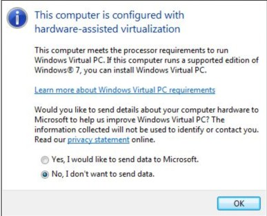
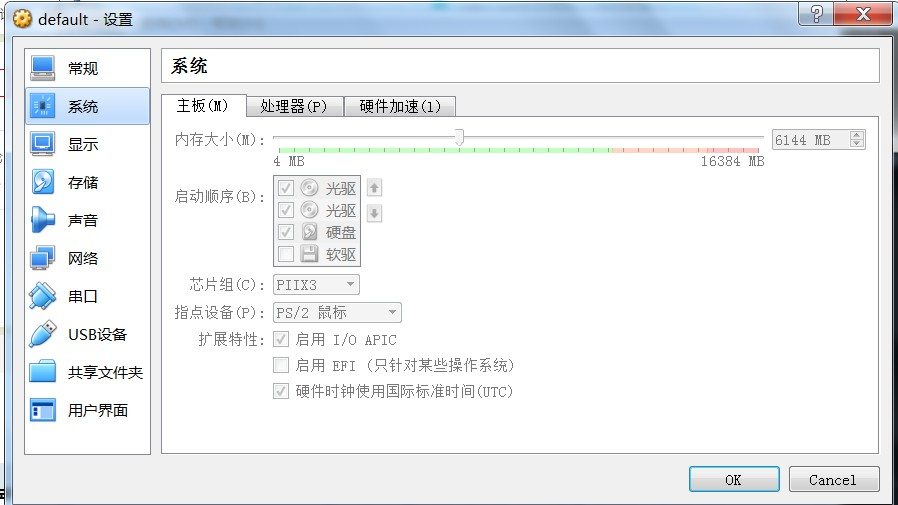

# docker-tutorial

[TOC]

## 基础知识

由于虚拟机存在这些缺点，Linux 发展出了另一种虚拟化技术：Linux 容器（Linux Containers，缩写为 LXC）。

**Linux 容器不是模拟一个完整的操作系统，而是对进程进行隔离。**或者说，在正常进程的外面套了一个保护层。对于容器里面的进程来说，它接触到的各种资源都是虚拟的，从而实现与底层系统的隔离。

**Docker 属于 Linux 容器的一种封装，提供简单易用的容器使用接口** **。**它是目前最流行的 Linux 容器解决方案。 

## 安装

### windows 7

- 下载[工具](https://www.microsoft.com/en-us/download/details.aspx?id=592)，判断CPU是否支持虚拟化，其中有`User Guide.mht `会指导显示结果，即显示`This computer is configured with hardware-assisted virtualization`。
- 下载[链接](https://docs.docker.com/toolbox/toolbox_install_windows/)，一路安装即可。



## image镜像和container容器的关系

### 镜像是容器的模板，容器是镜像的实例

**Docker 把应用程序及其依赖，打包在 image 文件里面。**只有通过这个文件，才能生成 Docker 容器。**image 文件可以看作是容器的模板。Docker 根据 image 文件生成容器的实例。**同一个 image 文件，可以生成多个同时运行的容器实例。

image 是二进制文件。实际开发中，一个 image 文件往往通过继承另一个 image 文件，加上一些个性化设置而生成。举例来说，你可以在 Ubuntu 的 image 基础上，往里面加入 Apache 服务器，形成你的 image。

### 容器实例也是一个文件：容器文件，需要手动删除

**image 文件生成的容器实例，本身也是一个文件，称为容器文件。**也就是说，一旦容器生成，就会同时存在两个文件： image 文件和容器文件。而且关闭容器并不会删除容器文件，只是容器停止运行而已。

> ```
> # 列出本机正在运行的容器
> $ docker container ls
> 
> # 列出本机所有容器，包括终止运行的容器
> $ docker container ls --all
> ```

上面命令的输出结果之中，包括容器的 ID。很多地方都需要提供这个 ID，比如上一节终止容器运行的`docker container kill`命令。

终止运行的容器文件，依然会占据硬盘空间，可以使用[`docker container rm`](https://docs.docker.com/engine/reference/commandline/container_rm/)命令删除。

> ```
> $ docker container rm [containerID]
> ```

运行上面的命令之后，再使用`docker container ls --all`命令，就会发现被删除的容器文件已经消失了。

## hello world

下面，我们通过最简单的 image 文件"[hello world"](https://hub.docker.com/r/library/hello-world/)，感受一下 Docker。

需要说明的是，国内连接 Docker 的官方仓库很慢，还会断线，需要将默认仓库改成国内的镜像网站，具体的修改方法在[下一篇文章](http://www.ruanyifeng.com/blog/2018/02/docker-wordpress-tutorial.html)的第一节。有需要的朋友，可以先看一下。

首先，运行下面的命令，将 image 文件从仓库抓取到本地。

> ```
> $ docker image pull library/hello-world
> ```

上面代码中，`docker image pull`是抓取 image 文件的命令。`library/hello-world`是 image 文件在仓库里面的位置，其中`library`是 image 文件所在的组，`hello-world`是 image 文件的名字。

由于 Docker 官方提供的 image 文件，都放在[`library`](https://hub.docker.com/r/library/)组里面，所以它的是默认组，可以省略。因此，上面的命令可以写成下面这样。

> ```
> $ docker image pull hello-world
> ```

抓取成功以后，就可以在本机看到这个 image 文件了。

> ```
> $ docker image ls
> ```

现在，运行这个 image 文件。

> ```
> $ docker container run hello-world
> ```

`docker container run`命令会从 image 文件，生成一个正在运行的容器实例。

注意，`docker container run`命令具有自动抓取 image 文件的功能。如果发现本地没有指定的 image 文件，就会从仓库自动抓取。因此，前面的`docker image pull`命令并不是必需的步骤。

如果运行成功，你会在屏幕上读到下面的输出。

> ```
> $ docker container run hello-world
> 
> Hello from Docker!
> This message shows that your installation appears to be working correctly.
> 
> ... ...
> ```

输出这段提示以后，`hello world`就会停止运行，容器自动终止。

有些容器不会自动终止，因为提供的是服务。比如，安装运行 Ubuntu 的 image，就可以在命令行体验 Ubuntu 系统。

> ```
> $ docker container run -it ubuntu bash
> ```

对于那些不会自动终止的容器，必须使用[`docker container kill`](https://docs.docker.com/engine/reference/commandline/container_kill/) 命令手动终止。

> ```
> $ docker container kill [containID]
> ```

## 容器的控制

**（1）docker container start**

前面的`docker container run`命令是新建容器，每运行一次，就会新建一个容器。同样的命令运行两次，就会生成两个一模一样的容器文件。如果希望重复使用容器，就要使用`docker container start`命令，它用来启动已经生成、已经停止运行的容器文件。

> ```
> $ docker container start [containerID]
> ```

**（2）docker container stop**

前面的`docker container kill`命令终止容器运行，相当于向容器里面的主进程发出 SIGKILL 信号。而`docker container stop`命令也是用来终止容器运行，相当于向容器里面的主进程发出 SIGTERM 信号，然后过一段时间再发出 SIGKILL 信号。

> ```
> $ bash container stop [containerID]
> ```

这两个信号的差别是，应用程序收到 SIGTERM 信号以后，可以自行进行收尾清理工作，但也可以不理会这个信号。如果收到 SIGKILL 信号，就会强行立即终止，那些正在进行中的操作会全部丢失。

## 关键命令

### 查看现有的镜像和容器

```docker
docker image ls
docker container ls
docker container ls -a 包括已经停止的容器
```

### 从本地导入镜像及删除镜像

```docker
# i表示本地input
docker load -i ltp_3_4_0.tar

docker rmi [imageID]
```

```docker
#注意需要先删除容器，再删除镜像
通过容器id先删除容器  
docker rm 4a0c0eb71ea5    
然后方能删除镜像  
docker rmi 96106cbe3107  
```

### 在容器内运行的命令

```docker
docker container run <镜像名>
docker run <镜像名> #表示直接在新容器内运行，新建一个容器再运行
```

### 删除容器实例（容器文件）

```docker
# 列出本机正在运行的容器
$ docker container ls

# 列出本机所有容器，包括终止运行的容器
$ docker container ls --all

# 根据容器ID，删除容器实例
docker container rm [containerID]
```

### 启动已经生成的容器

```docker
#避免docker container run生成新的容器实例，此命令可以对已有实例进行重新运行。
docker container start [containerID]
docker container stop [containerID]
```

### 启动和关闭docker

```docker
docker-machine stop
docker-machine start
```

这将会清楚所有image和container

### 设置docker内存

对于window使用virtualbox，关闭docker后，点击进入virtualbox进行手动设置。



### 查看容器log记录

`docker container logs`命令用来查看 docker 容器的输出，即容器里面 Shell 的标准输出。如果`docker run`命令运行容器的时候，没有使用`-it`参数，就要用这个命令查看输出。

> ```
> $ docker container logs [containerID]
> ```

### 得到container的ip地址

```docker
#输入container的id
docker inspect -f '{{range .NetworkSettings.Networks}}{{.IPAddress}}{{end}}' container_name_or_id
```

### Connection refused

```docker
#得到实际ip
docker-machine ip default
#然后再发送curl
curl http://$(docker-machine ip default):8080
```

###退出关闭和但不关闭容器

| 方式                                  | 结果                                         | 再次启动                    |
| ------------------------------------- | -------------------------------------------- | --------------------------- |
| exit（命令）                          | 退出后，这个容器也就消失了，容器销毁ps查不到 | docker start 容器名/容器id  |
| Ctrl+D（快捷方式）                    | 退出后，这个容器也就消失了,容器销毁ps查不到  | docker start 容器名/容器id  |
| 先按，Ctrl+P;再按，Ctrl+Q（快捷方式） | 退出容器，ps能查到，还在后台运行             | docker attach 容器名/容器id |

### 重新进入容器

```
# 重新进入容器
docker attach xxxxxxxx
# 或者
docker exec -it xxxxxxxx /bin/bash
```

attach 与 exec 主要区别如下:

1. attach 直接进入容器 **启动命令** 的终端，不会启动新的进程。
2. exec 则是在容器中打开新的终端，并且可以启动新的进程。
3. 如果想直接在终端中查看启动命令的输出，用 attach；其他情况使用 exec。

##实际项目

### 使用windows打开命令提示符操作docker

```
@FOR /f "tokens=*" %i IN ('docker-machine env default') DO @%i
```
###清空container和image
```linux
# Delete every Docker containers
# Must be run first because images are attached to containers
docker rm -f $(docker ps -a -q)

# Delete every Docker image
docker rmi -f $(docker images -q)
```

###创建镜像

**Dockerfile** 是记录了镜像是如何被构建出来的配置文件, 可以被 `docker` 直接执行以创建一个镜像。

镜像的定制实际上就是定制每一层所添加的配置、文件。如果我们可以把每一层修改、安装、构建、操作的命令都写入一个脚本，用这个脚本来构建、定制镜像，那么之前提及的无法重复的问题、镜像构建透明性的问题、体积的问题就都会解决。这个脚本就是 Dockerfile。

Dockerfile 是一个文本文件，其内包含了一条条的 **指令(Instruction)**，每一条指令构建一层，因此每一条指令的内容，就是描述该层应当如何构建。

```linux
mkdir horovod-docker
wget -O horovod-docker/Dockerfile https://raw.githubusercontent.com/horovod/horovod/master/Dockerfile
docker build -t horovod:latest horovod-docker #-t表示设置要构建镜像的标签
```

### 问题解决

#### [Docker Machine: No space left on device](https://stackoverflow.com/questions/31909979/docker-machine-no-space-left-on-device)

```linux
docker system prune
docker volume prune  # as suggested by @justin-m-chase since system prune does not clean volumes.
```


### 运行docker

####GPU

如果没有`default-runtime`的配置，在运行时添加一个参数`--runtime`，也能使容器可以访问GPU资源。

```linux
docker run --runtime=nvidia -it --rm  -v /data1/upload_single_deploy:/bert tensorflow/tensorflow:latest-gpu-py3

docker run --runtime=nvidia --name=training -it --rm  -v /data1/upload_parallel_deploy:/bert tensorflow/tensorflow:latest-gpu-py3

docker run --runtime=nvidia -it --rm  -v /data1/upload_single_deploy:/bert horovod:latest
```

docker可以支持把一个宿主机上的目录挂载到镜像里。**将目录内映射到一个新建的目录中。前面和后面无需/，只需要文件名既可以，等于在container新建一个bert的文件夹，里面的内容是upload_single_deploy的**，通过-v参数，冒号前为宿主机目录，必须为绝对路径，冒号后为镜像内挂载的路径。

container停止时会把挂在上面的volume保存方便调试，而使用rm会去掉这些，方便清理。

`-it` is short for `--interactive + --tty` when you `docker run` with this command.. **it would take you straight inside of the container** 

Without `-t` tag one can still interact with the container, but with it, you'll have a nicer, more features terminal 

`--name`起名

####CPU

```linux
docker run -it --rm  -v /data1/upload_singer_deploy/:/bert horovod:latest
```

###修改container

进行必要修改，其中的包从[pypi官网](https://pypi.org/project/scikit-learn/#files )下载

```shell
docker run --runtime=nvidia -it --rm  -v /data1/upload_parallel_deploy/wheel-lib:/wheel-lib tensorflow/tensorflow:latest-gpu-py3
pip install scipy
```

####或者直接进行commit不用下面两步经常出错
```linux
docker commit 2e118103c364 dev/multigpu:v1.0
```

####导出container

```linux
docker export 2e118103c364 > confidence.tar
```

####修改完后再导入镜像
```linux
cat confidence.tar | docker import - dev/multigpu:v1.0
```

####允许import导入的镜像，需要指定command

原因在于：`docker export` does not export everything about the container — just the filesystem. So, when importing the dump back into a new docker image, additional flags need to be specified to recreate the context.

其中command从以下信息得到。

```linux
$ docker container ls -a
CONTAINER ID        IMAGE                                  COMMAND             C
REATED             STATUS              PORTS               NAMES
2e118103c364        tensorflow/tensorflow:latest-gpu-py3   "/bin/bash"         2
7 minutes ago      Up 15 minutes                           adoring_lamport
```

```linux
docker run --runtime=nvidia -it --rm  -v /data1/upload_parallel_deploy:/bert dev/multigpu:v1.0 /bin/bash
```

## Reference

- [windows docker安装](https://docs.docker.com/toolbox/toolbox_install_windows/#looking-for-troubleshooting-help)
- [阮一峰-Docker 入门教程](http://www.ruanyifeng.com/blog/2018/02/docker-tutorial.html)

